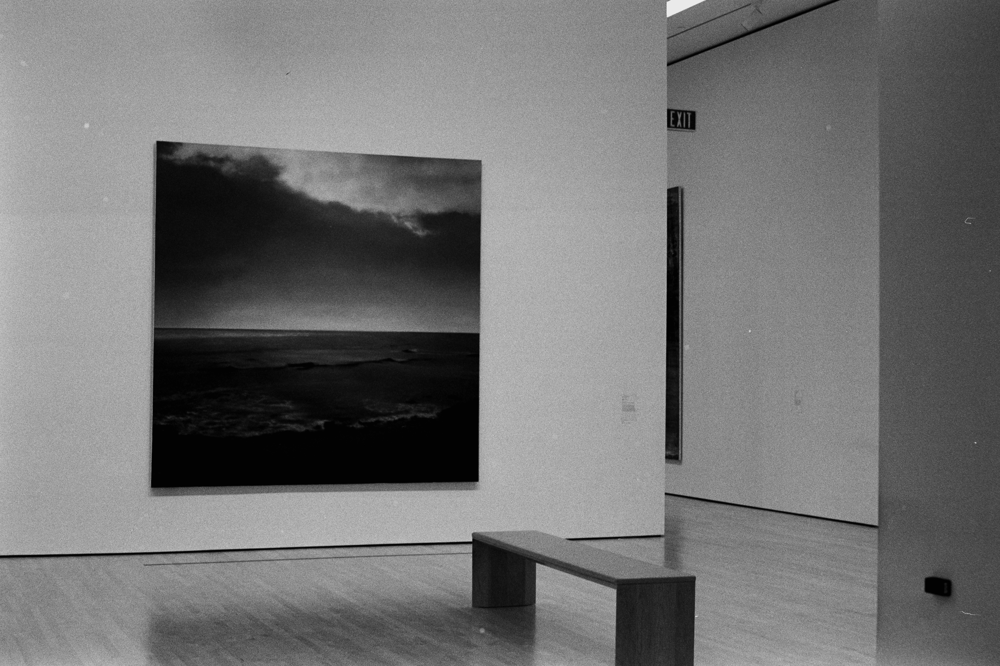
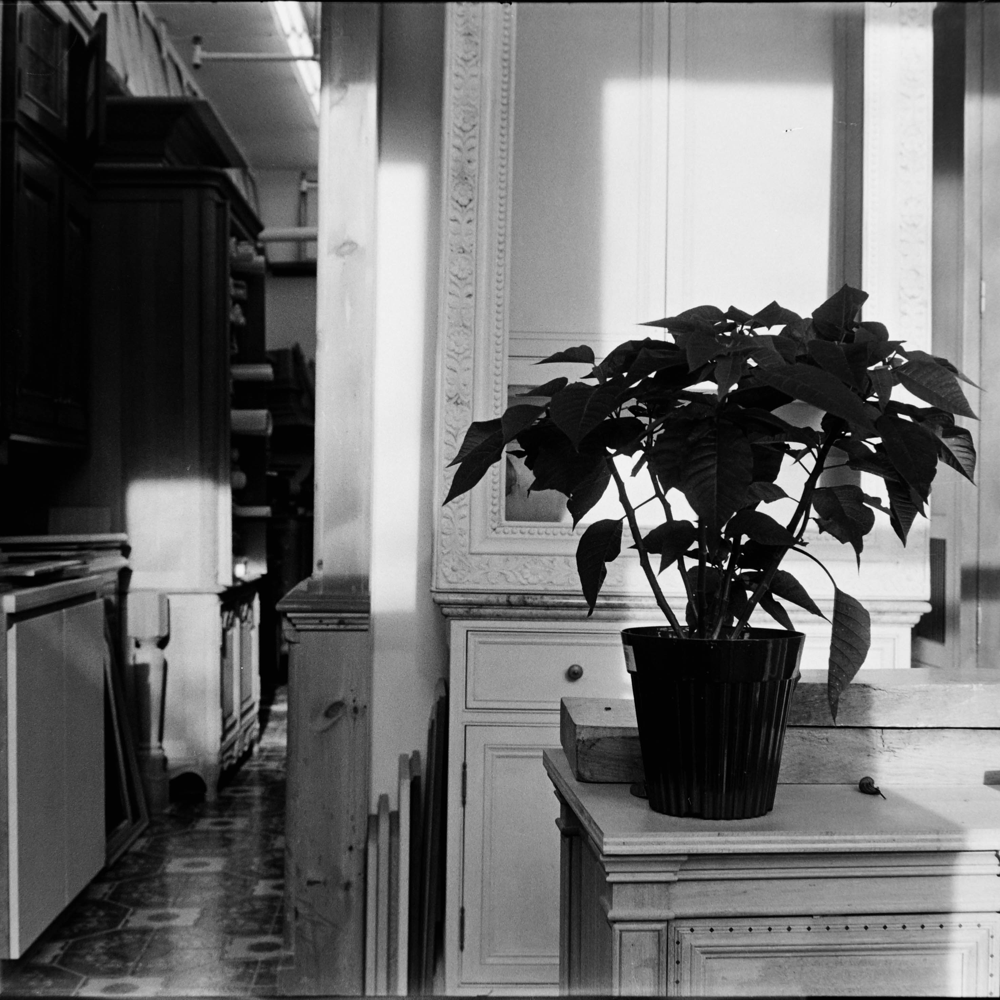
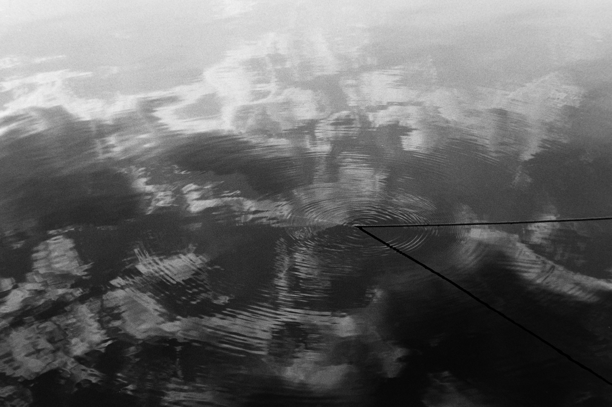
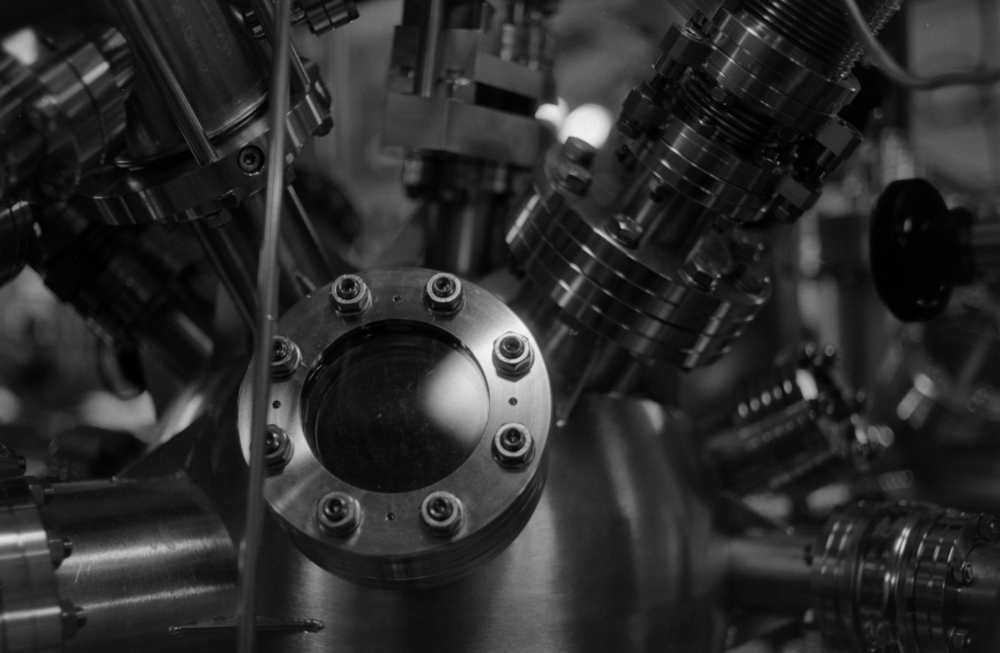

#### A small selection of film photography projects exploring quiet scenes, abstraction, memory, and atmosphere.

 

  <h2>A</h2>

  

    
    
  

  <h2>B</h2>

  

    
    
  

  <h2>C</h2>

  

    
    
  

