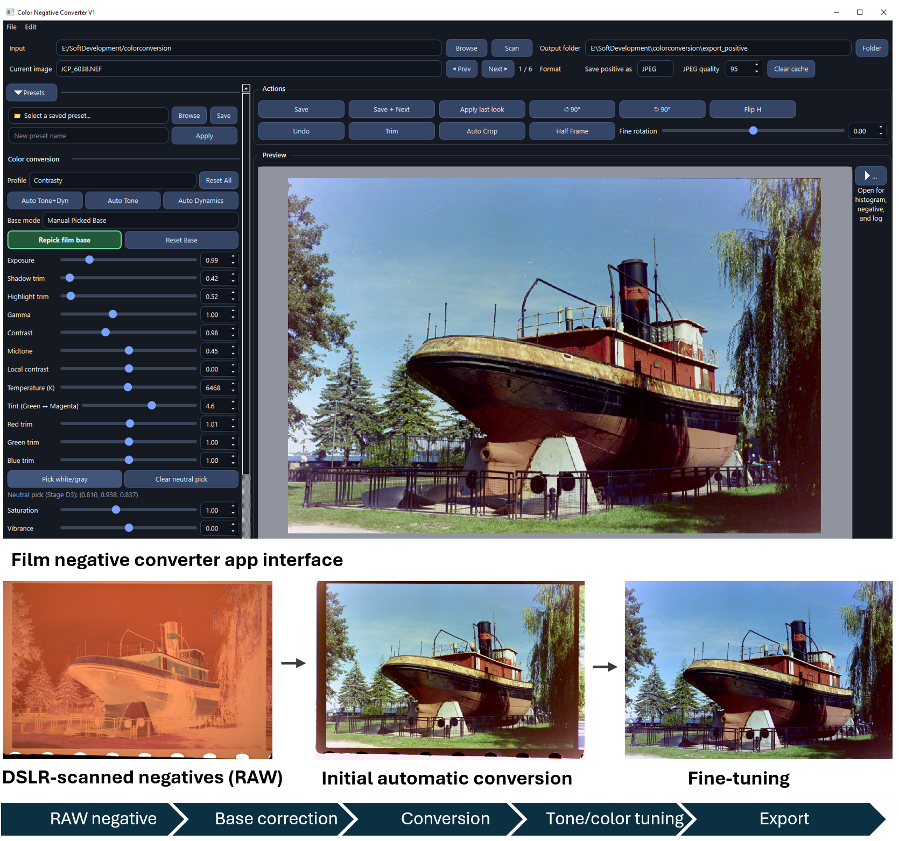
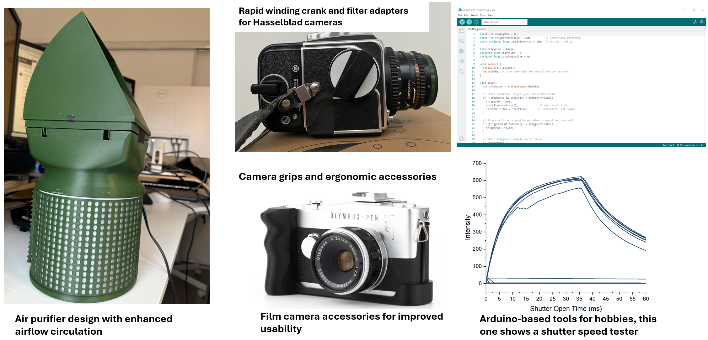

### Personal projects are where I explore practical tools, small systems, design ideas, and visual experiments outside formal R&D work. Some are technical, some are artistic, and some sit between the two.

# Personal Projects

 

  <h2>Film Negative Converter App</h2>
  
Photography Tools / Image Processing / Open-Source AI-Assisted Tool Building

  

  I am developing an open-source film negative conversion tool for DSLR-scanned color negatives using AI-assisted coding. My role is not traditional software development; instead, I define the photographic workflow, conversion logic, interface behavior, and validation criteria, then iteratively build and refine the Python/PyQt app with AI support. The goal is to create a practical open-source tool for serious film photographers who want more control over negative conversion without relying only on slow or expensive commercial workflows. The app focuses on film-base correction, color-negative conversion, tone adjustment, trimming, presets, and batch export.
  

  

    
  

  

  Open-source, AI-assisted Python/PyQt tool-building project for DSLR film negative conversion, including base correction, automatic conversion, tone/color tuning, and export.
  

 

 

  <h2>3D-Printed Functional Designs</h2>
  
CAD / 3D Printing / Photography, Home Systems, and Hobby Tools

  

  I design and 3D print functional parts for photography, home systems, and hobby tools/devices. These projects are driven by practical needs: improving airflow circulation, adapting cameras and accessories, improving usability, and building simple tools that are difficult or expensive to buy. The work combines CAD design, printability, fit testing, simple electronics, sensor-based logic, signal analysis, and iterative refinement.
  

  

    
  

  

  Selected personal hardware projects, including an air purifier design with enhanced airflow circulation, film camera accessories, ergonomic grips, and Arduino-based hobby tools/devices involving simple electronics and signal analysis.
  

