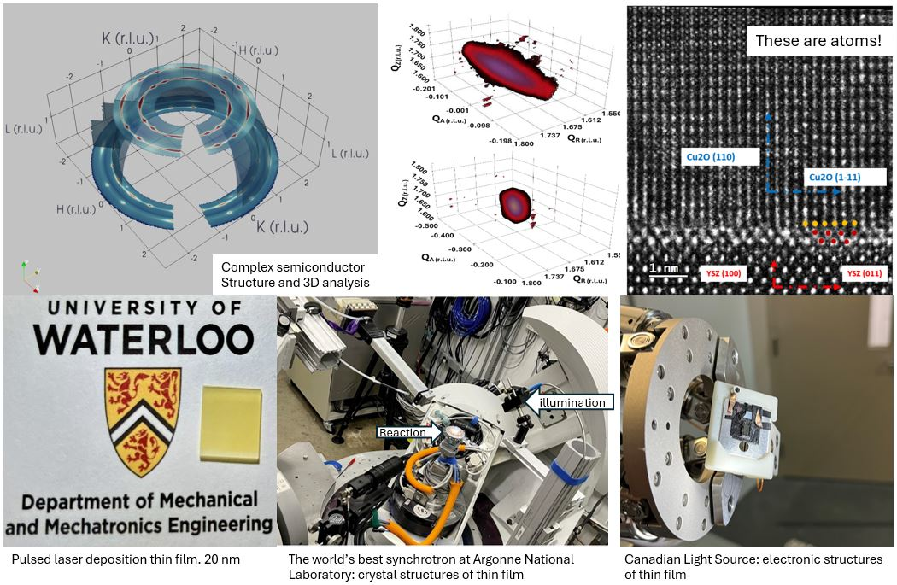

# Professional / R&D

Selected work across photochemical systems, polymer materials, thin-film fabrication, synchrotron characterization, and prototype/system design.

 

  <h2>Semiconductor Thin-Film Fabrication and Characterization</h2>

  
<strong>What I did:</strong> 
  Fabricated and characterized semiconductor thin films and interface-engineered materials, focusing on how processing, morphology, and interfacial structure affect material behavior.

  
<strong>Methods / tools:</strong> 
  Thin-film fabrication, coating, XRD, microscopy, spectroscopy, and electronic/material characterization.

  

    
  

