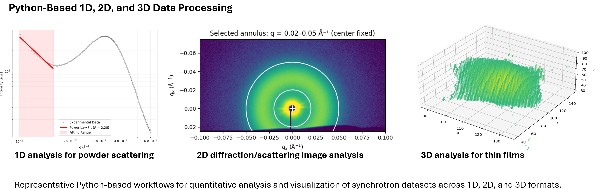
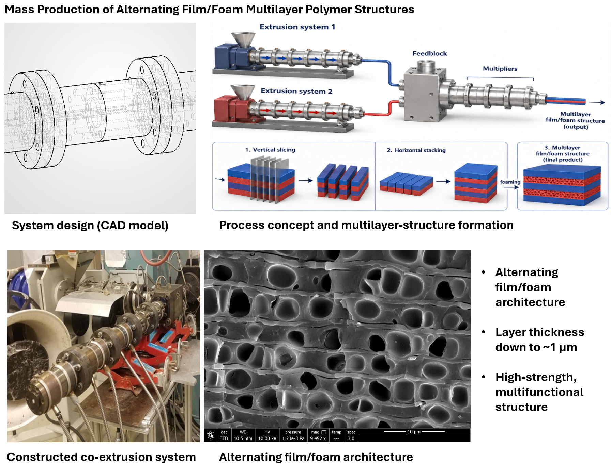
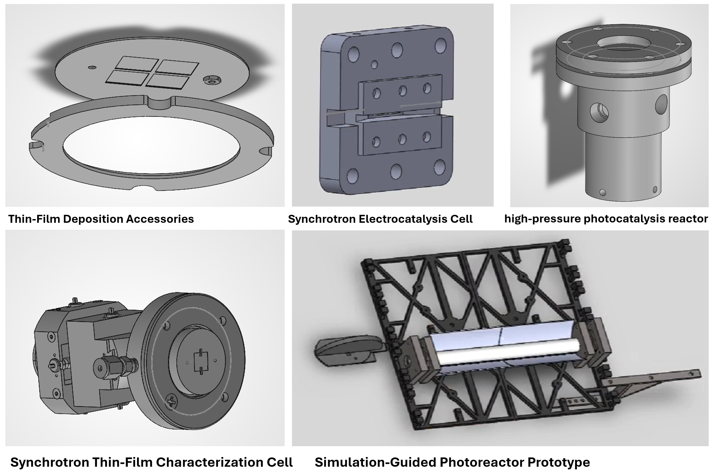

Selected work across photochemical systems, polymer materials, thin-film fabrication, synchrotron characterization, and prototype/system design.

 

  <h2>Semiconductor Thin-Film Fabrication and Characterization</h2>
  
Materials

  
<strong>Overview:</strong> 
I designed, fabricated, and characterized complex semiconductor thin films, including films less than 10 nm thick, using advanced pulsed laser deposition. This work connected thin-film growth, crystallography, morphology, strain analysis, and atomic-scale structural characterization to understand how processing and interfaces shape material behavior.

  

    
  

 

  <h2>Advanced In Situ Synchrotron Characterization of Thin Films</h2>
  
Advanced Characterization

  
<strong>Overview:</strong> 
  I developed synchrotron-based characterization workflows to study how semiconductor thin films evolve during interactions with light, reactants, and controlled environments. This work combined custom in situ measurement systems, beamline-compatible reactor/tool design, and advanced data analysis to connect thin-film structural and electronic changes under functionally relevant conditions.

  

Custom in situ synchrotron setups and analysis workflows for tracking structural and electronic changes in semiconductor thin films under light/reactant interactions.

 

 

  <h2>Advanced Data Processing and Scientific Computing</h2>
  
Data Analysis and AI-Assisted Scientific Computing

  
<strong>Overview:</strong> 
  I build AI-assisted Python data-processing and visualization workflows for advanced materials characterization. These tools support 1D, 2D, and 3D analysis of synchrotron datasets, including powder scattering, diffraction images, and thin-film structural data. My role focuses on defining the scientific analysis logic, validating the results, and turning experimental needs into usable tools.

  

    
  

  <h2>Simulation-Guided System Design for Artificial Photosynthesis</h2>
  
Reactor and System Design

<strong>Overview:</strong> 
I used COMSOL simulations to design artificial photosynthesis reactors with better light collection and distribution. The simulation results guided the design, construction, and operation of a prototype photochemical reaction system.

  

    
  

  

COMSOL optical modeling, reactor design, and prototype system construction for simulation-guided artificial photosynthesis.

 

  <h2>Multilayer Film/Foam Polymer Structures</h2>
  
Processing and Manufacturing Scale-Up

  
<strong>Overview:</strong> 
  I co-designed and built a multilayer polymer processing system, then developed the process and material combination needed to mass-produce alternating film/foam structures with micron-scale layers. This work enabled multilayer polymer architectures with micron-scale layers and improved structural and functional potential.

  

    
  

 

  <h2>Selected Hardware and System Designs</h2>
  
Experimental Hardware and Prototype Design

  
<strong>Overview:</strong> 
  I design custom hardware and experimental systems for advanced characterization, reaction engineering, and prototype development. Selected examples include synchrotron-compatible measurement cells, thin-film deposition accessories, high-pressure photocatalysis reactors, electrochemical testing tools, and simulation-guided photoreactor prototypes.

  

    
  

