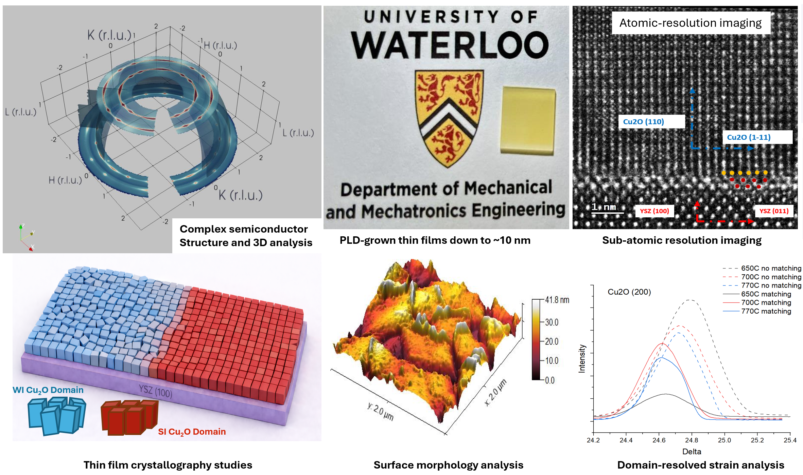
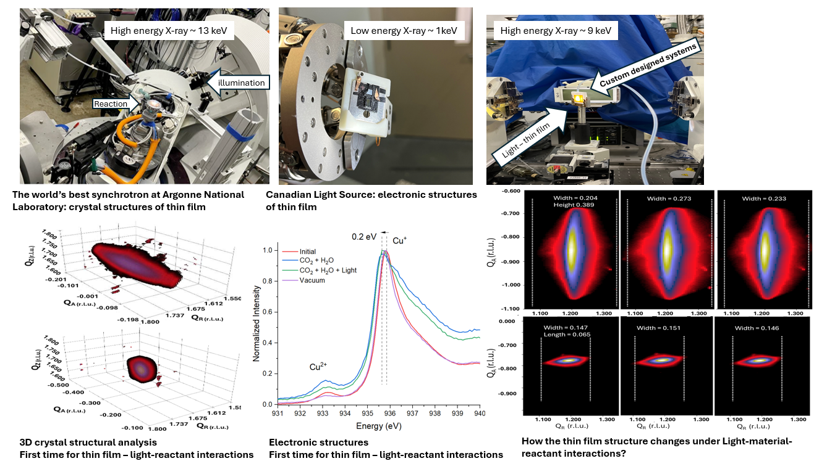
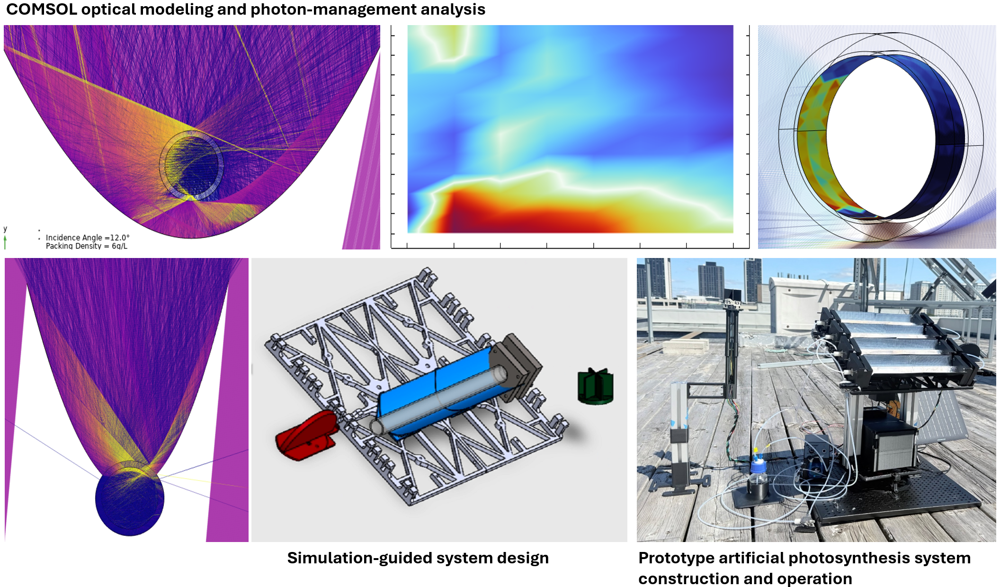

Selected work across photochemical systems, polymer materials, thin-film fabrication, synchrotron characterization, and prototype/system design.

 

  <h2>Semiconductor Thin-Film Design, Fabrication, and Characterization</h2>

  
<strong>Overview:</strong> 
I designed, fabricated, and characterized complex semiconductor thin films, including films less than 10 nm thick, using advanced pulsed laser deposition. This work connected thin-film growth, crystallography, morphology, strain analysis, and atomic-scale structural characterization to understand how processing and interfaces shape material behavior.

  

    
  

 

  <h2>Advanced In Situ Synchrotron Characterization of Thin Films</h2>

  
<strong>Overview:</strong> 
  I developed synchrotron-based characterization workflows to study how semiconductor thin films evolve during interactions with light, reactants, and controlled environments. This work combined custom in situ measurement systems, beamline-compatible reactor/tool design, and advanced data analysis to connect thin-film structural and electronic changes under functionally relevant conditions.

  

Custom in situ synchrotron setups and analysis workflows for tracking structural and electronic changes in semiconductor thin films under light/reactant interactions.

 

  <h2>Simulation-Guided System Design for Artificial Photosynthesis</h2>

  
<strong>Overview:</strong> 
  I studied how to improve photon utilization and reactor-volume utilization in artificial photosynthesis systems. I used optical simulations to develop system design and operation principles, which were then used to guide the construction and operation of a prototype reaction system.

  

    
  

 

  <h2>Multilayered Complex Polymer Structures</h2>

  
<strong>Overview:</strong> 
  I designed and operated processing systems capable of producing multilayered polymer structures with more than 1,000 layers. I also designed complex foam/film alternating structures by selecting suitable materials and controlling the multilayer architecture.

  

    
  

