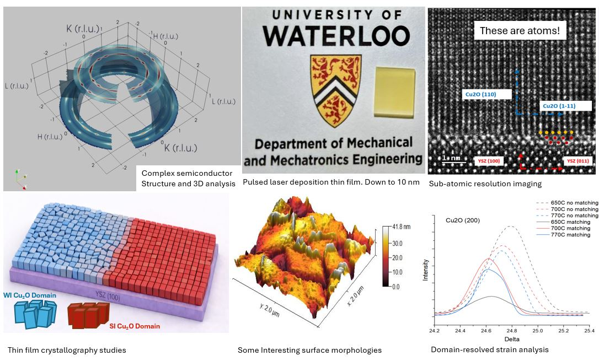

# Professional / R&D

Selected work across photochemical systems, polymer materials, thin-film fabrication, synchrotron characterization, and prototype/system design.

 

  

    
  

  

    <h2>Semiconductor Thin-Film Fabrication and Characterization</h2>

    
<strong>What I did:</strong> 
    Fabricated and characterized semiconductor thin films and interface-engineered materials, focusing on how processing, morphology, and interfacial structure affect material behavior.

    
<strong>Methods / tools:</strong> 
    Thin-film fabrication, coating, XRD, microscopy, spectroscopy, and electronic/material characterization.

  

