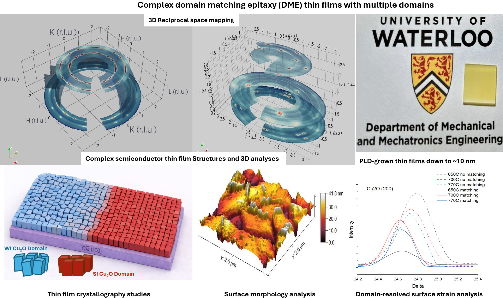
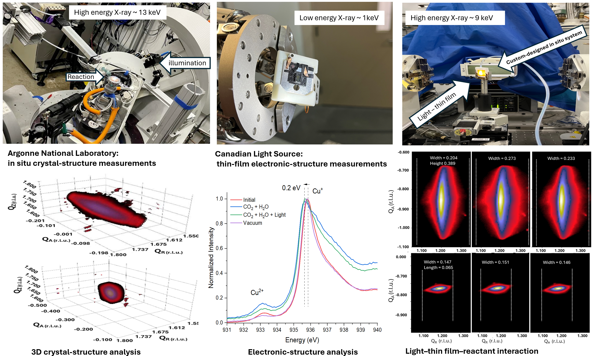
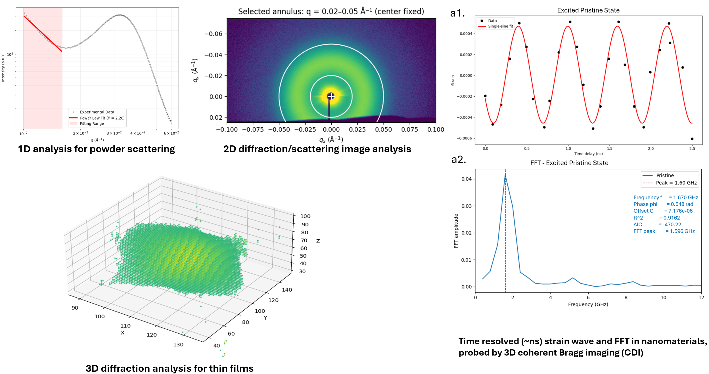
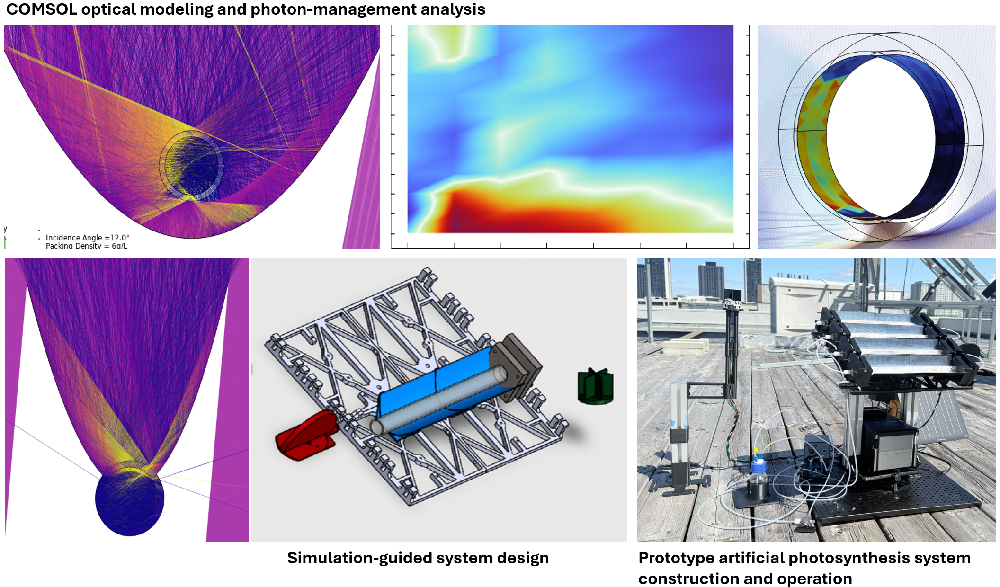
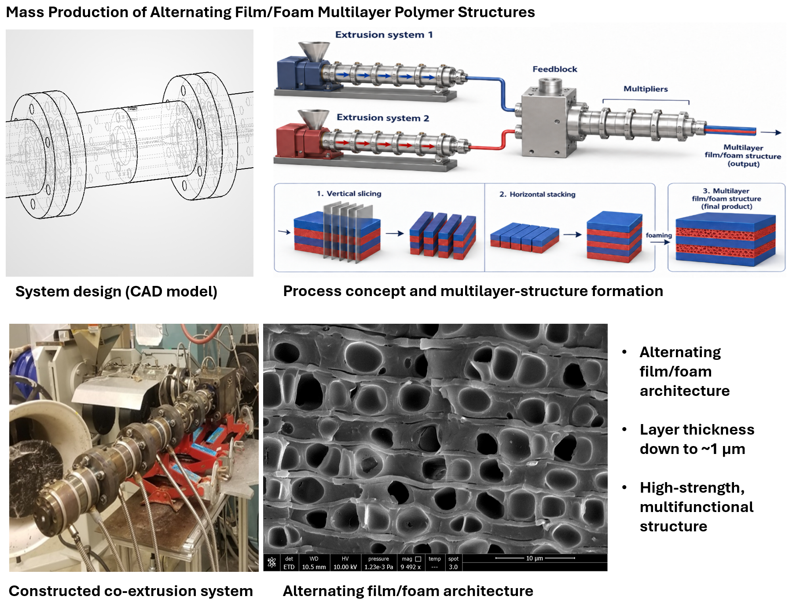
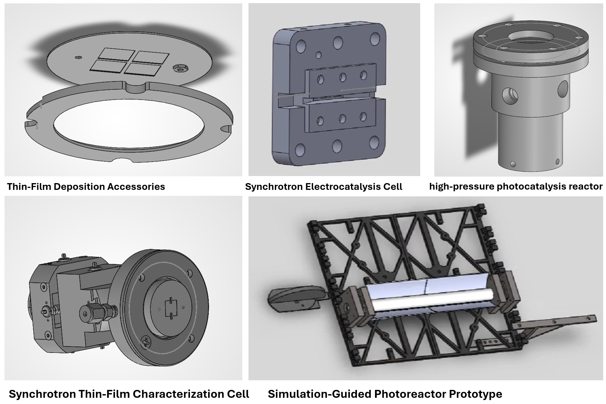

#### Selected work across thin films, nanomaterials, advanced characterization, data analysis, reactor systems, and prototype development.

 

 

  <h2>Semiconductor Thin-Film Fabrication and Characterization</h2>
  
Advanced Materials

  

I designed, fabricated, and characterized complex semiconductor thin films, including sub-10 nm films, to study how processing, structure, morphology, strain, defects, and interfaces shape material behaviors. I used pulsed laser deposition (PLD) to make both fully expitaxial and domain-matching epitaxial thin films based on substrate-thin film lattice interactions. 

  

    
  

 
 
  

    
  

  

Representative thin-film fabrication, crystallography, morphology, strain analysis, and atomic-scale characterization.

 

  <h2>Advanced In Situ Synchrotron Characterizations of Thin Films</h2>
  
Advanced Characterization

  

I developed advanced synchrotron-based characterization workflows, custom in situ tools, and beamline-compatible reactors to study crystal and electronic structural changes in semiconductor thin films under functionally relevant conditions, using diffraction and spectroscopic techniques. 

  

Custom in situ synchrotron setups and analysis workflows for tracking structural and electronic changes in semiconductor thin films under light/reactant interactions.

 

 

  <h2>Advanced Data Processing and Scientific Computing</h2>
  
Data Analysis and AI-Assisted Scientific Computing

  

  I build AI-assisted Python data-processing and visualization workflows for advanced materials characterization. These tools support 1D, 2D, and 3D analysis of synchrotron datasets, including powder scattering, diffraction images, and thin-film structural data. 

  

    
  

Representative AI-assisted Python workflows for quantitative analysis and visualization of synchrotron datasets across 1D, 2D, and 3D formats.

 
 

  <h2>Simulation-Guided System Design for Artificial Photosynthesis</h2>
  
Simulation and System Design

I used COMSOL optical simulations to guide the design, construction, and operation of prototype artificial photosynthesis reactors with improved light collection and distribution.

  

    
  

  

COMSOL optical modeling, reactor design, and prototype system construction for simulation-guided artificial photosynthesis.

 

  <h2>Multilayer Film/Foam Polymer Structures</h2>
  
Processing and Manufacturing Scale-Up

I co-designed and built a multilayer polymer processing system, then developed the process and material system needed to mass-produce alternating film/foam architectures with micron-scale structure and improved functional potential.

  

    
  

  

System design, process development, and structure characterization for mass production of alternating film/foam multilayer polymer structures.

 

  <h2>Selected Hardware and System Designs</h2>
  
Experimental Hardware and Prototype Design

  

  I design custom hardware and experimental systems for advanced characterization, reaction engineering, and prototype development. Examples include synchrotron-compatible measurement cells, thin-film deposition accessories, high-pressure photocatalysis reactors, electrochemical testing tools, and simulation-guided photoreactor prototypes.

  

    
  

Selected custom hardware and system designs for advanced characterization, reaction engineering, and prototype development.

